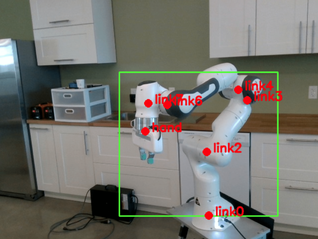

# Robot-Keypoints

Keypoint RCNN based robot joints detection. Original paper is from:
 - [Mask R-CNN](https://arxiv.org/abs/1703.06870)



[Test image source]: Deep Robot-to-Camera Extrinsics for Articulated Manipulators ([DREAM](https://github.com/NVlabs/DREAM))

## Installation
 - Clone this repository:
   ```Shell
   git clone https://github.com/kidpaul94/Robot_Keypoints.git
   ```
 - Download dependencies:
   ```Shell
   pip3 install opencv-python albumentations torch torchvision
   ```

## Training & Evaluation
 - How to train the network:
   ```Shell
   python3 custom_train.py 
   ```
 - How to perform evaluation:
   ```Shell
   python3 eval.py 
   ```
   
`custom_train.py`, `eval.py` have several arguments to pass. Run the `--help` command to see more information.

## Annotation format
```Shell
{"bboxes": [[x_c, y_c, w, h]], "keypoints": [[[x1, y1, v1], [x2, y2, v2], [x3, y3, v3], ... , [x7, y7, v7]]]}
```
